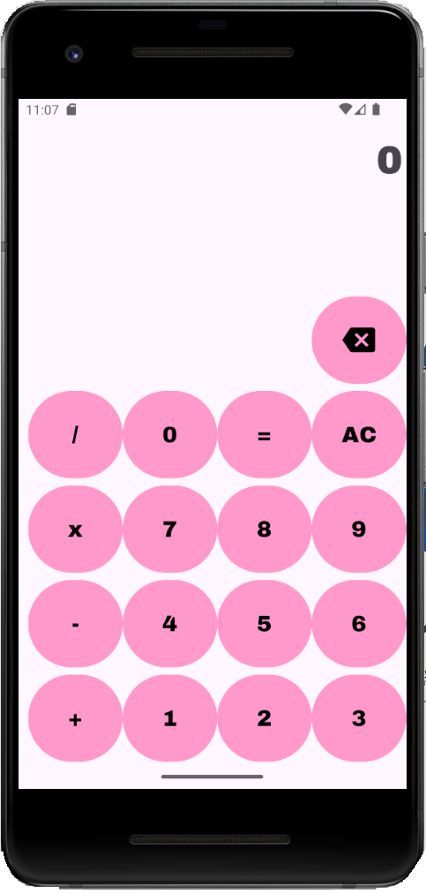

# 🧮 CalculatorApp

Bu proje, Android Studio ve Kotlin kullanılarak geliştirilen basit ama modern bir hesap makinesi uygulamasıdır. Uygulama, kullanıcı dostu bir arayüz ile toplama, çıkarma, çarpma ve bölme işlemlerini gerçekleştirebilir. **Sıfırdan** geliştirilmiş bu projede **ViewBinding**, **Navigation Component** ve **Fragment mimarisi** etkin bir şekilde kullanılmıştır.

---

## 🚀 Özellikler

- 📲 **Modern ve kullanıcı dostu arayüz**
- ➕ ➖ ✖️ ➗ Dört temel aritmetik işlem
- 🔄 **Geri silme tuşu (⌫)**: Son basamağı siler
- ❌ **AC tuşu**: Tüm ifadeyi sıfırlar
- 🧮 Gerçek zamanlı hesaplama ve işlem sıralaması
- 🔀 Navigation Component kullanılarak **fragment tabanlı yapı**
- 💡 `ViewBinding` ile güvenli ve okunabilir View erişimi
- ⚙️ API 21+ uyumlu, tüm cihazlarda çalışır

---

## 🧱 Kullanılan Teknolojiler

| Yapı                              | Açıklama                                          |
| --------------------------------- | ------------------------------------------------- |
| **Kotlin**                        | Uygulama dili                                     |
| **Fragment**                      | Ekran yapısı, modüler mimari                      |
| **Navigation Component**          | Fragment geçişlerini yönetmek için                |
| **ViewBinding**                   | XML öğelerine güvenli erişim                      |
| **ConstraintLayout & GridLayout** | UI düzenleri                                      |
| **MVVM benzeri yapı**             | UI ve mantık ayrımı için sadeleştirilmiş yaklaşım |

---

## 📱 Uygulama Arayüzü



## 🔧 Kurulum

1. Bu repoyu klonla:
   ```bash
   git clone https://github.com/sahinmelisa/android-kotlin-bootcamp/tree/main/Homeworks/CalculatorApp.git
   ```
